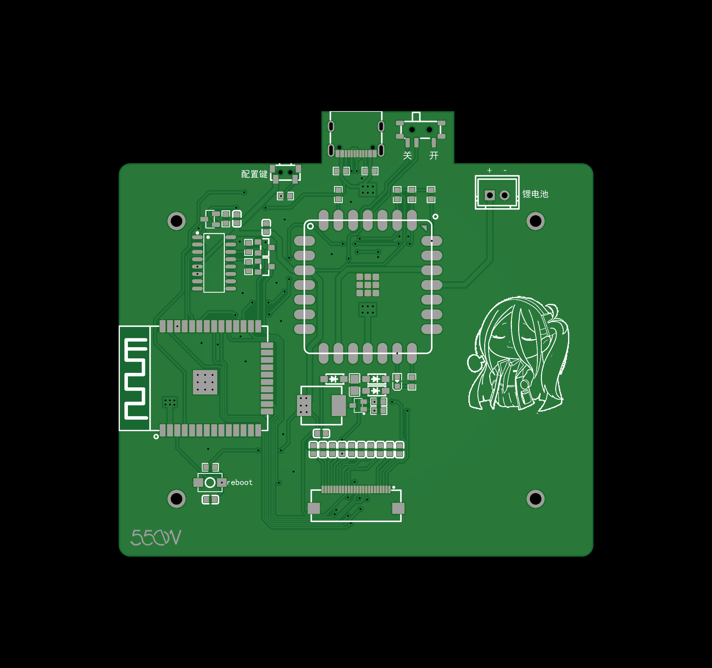

# 天气墨水屏终端电路板[Weather Terminal PCB]
这是天气墨水屏终端的电路板打板文件，理论上在嘉立创可以免费打板

更多的信息(BOM，Gerber)请在oshwhub上查看

[本项目的oshwhub链接](https://oshwhub.com/kitten_yyds/mo-shui-ping-0402)

另外，您可能还需要另一个开源项目的板子，这是链接：

[另一个项目的oshwhub开源链接](https://oshwhub.com/mondraker/axp202-zeng-ge-yan-zheng)