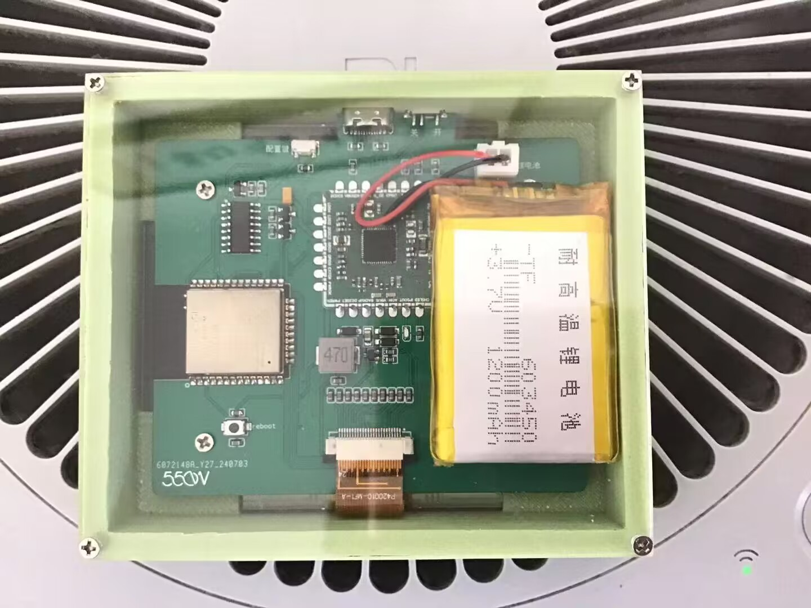

# 天气墨水屏终端[Weather Terminal]
基于ESP-IDF开发的4.2寸墨水屏天气终端

## 0.介绍
这是一个基于ESP32开发的4.2寸墨水屏天气终端

代码方面，代码前期使用Arduino IDE开发，后期使用ESP-IDF开发的项目

电路板PCB方面，前前后后共设计了7块板子，在这里，先感谢"嘉立创"提供的免费打板机会

外壳方面，使用Solidworks设计，设计时使用了两块亚克力板，8颗螺丝，和一个3D打印外壳