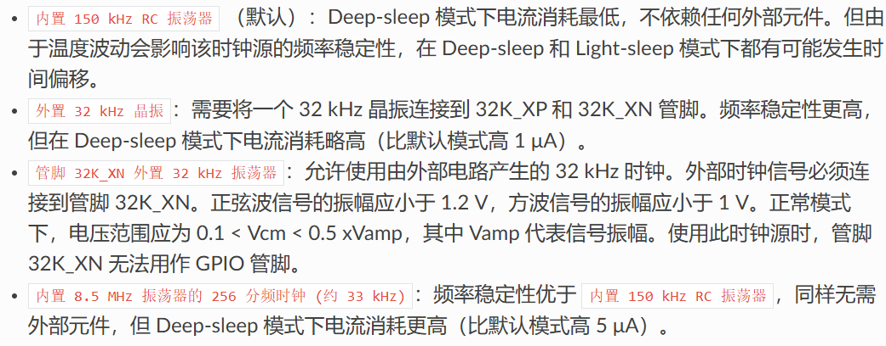

# 天气墨水屏终端[Weather Terminal]
基于ESP-IDF开发的4.2寸墨水屏天气终端

## 0.介绍
这是一个基于ESP32开发的4.2寸墨水屏天气终端

项目目标是通过网络获取数据并使用墨水屏显示天气，日期，文字(座右铭、鸡汤之类的)

该项目截止已经开发了半年(截止2024.7)，大量的已知bug已被改掉，但程序可能仍然有bug需要改，可以反馈到Issues中，我有时间尽量修改(高三了，可能要一年后罢)
## 1.硬件
### 1.屏幕：
使用的是SSD1683驱动的4.2寸三色墨水屏，使用的是GxEPD2库，但因为GxEPD2没有SSD1683的驱动程序，所以对GxEPD2做了一定的修改。由于这个库也兼容其他的显示屏，所以这套程序或许可以用到其他4.2寸三色墨水屏(不过我为了编译速度加快，删掉了其他显示屏的驱动程序，可能需要在github中的GxEPD2中寻找并添加回来)；
### 2.单片机：
使用的是乐鑫的ESP32-WROOM-32模组。这单片机自带2.4G无线网络；有足够多的引脚；双核，性能强悍；性价比高……啊吧啊吧(网上能查得到得就不在这里多说了)，反正非常适合这个项目；
### 3.电源：
电源部分太折磨人了，先后使用了LDO、升降压芯片、最后使用mondraker在oshwhub上开源的AXP202模组解决，在这里先感谢一下mondraker；该项目的电池使用的是4.2V的锂电池
### 4.外壳：
使用Solidworks建模，有3D打印的外壳，两个3mm厚的亚克力板，但是建模文件意外丢失，后面会重建补回
### 5.PCB电路板

## 2.软件
### 1、编程环境：
前期开发使用的简单容易开发的Arduino IDE，后期开发使用的是乐鑫的ESP-IDF

（开发时实验发现Arduino编译出来的代码，ESP32内部RTC时间不准确、不稳定，因为Arduino使用的时钟源是<u>"内置 150 kHz RC 振荡器"</u>，而ESP32内部时钟源并不只有"内置 150 kHz RC 振荡器"这么一个，还有一个更高精度的<u>"内置 8.5 MHz 振荡器的 256 分频时钟"</u>，但是这个时钟源貌似只能在ESP-IDF启用，于是把Arduino代码移植到ESP-IDF，后期在ESP-IDF中开发）
