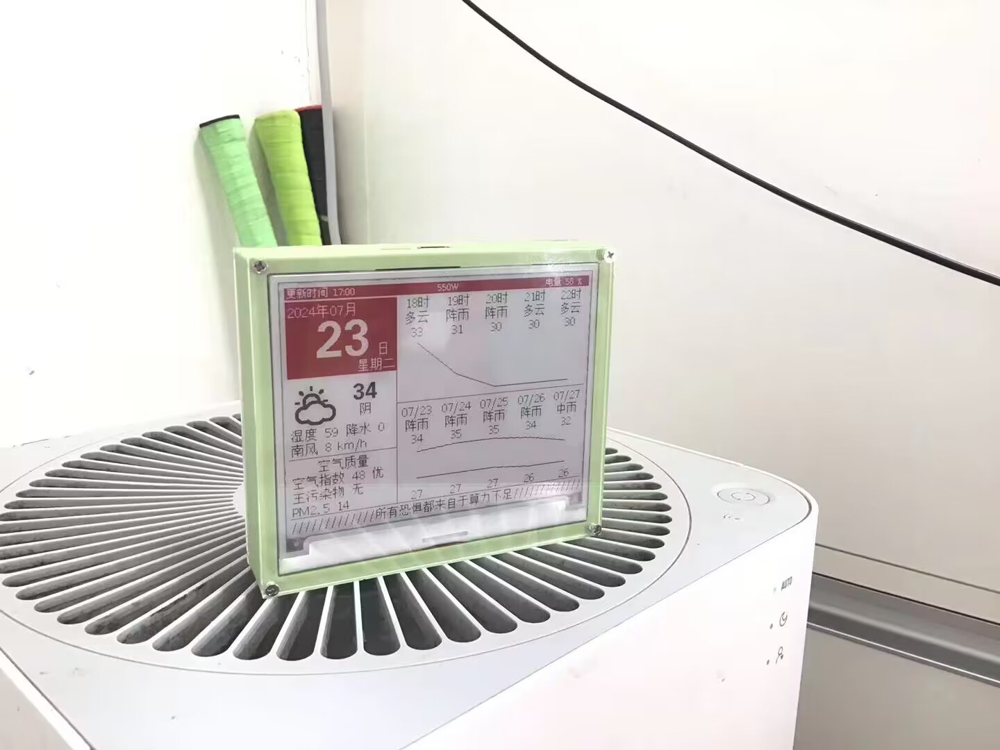

# 天气墨水屏终端[Weather Terminal]
基于ESP-IDF开发的4.2寸墨水屏天气终端

## 0.介绍
这是一个基于ESP32开发的4.2寸墨水屏天气终端

项目目标是通过网络获取数据并使用墨水屏显示天气，日期，文字(座右铭、鸡汤之类的)，同时应具备用电池供电的能力且低功耗的特点

该项目截止已经开发了半年(从2024.1到现在发布2024.7)，大量的已知bug已被改掉，但程序可能有bug需要改，可以反馈到Issues中，我有时间尽量修改(高三了，可能要一年后罢)，或者大佬可以克隆下来自行修改；
## 1.硬件
### 1.屏幕：
使用的是SSD1683驱动的4.2寸三色墨水屏，使用的是GxEPD2库，但因为GxEPD2没有SSD1683的驱动程序，所以对GxEPD2做了一定的修改。由于这个库也兼容其他的显示屏，所以这套程序或许可以用到其他4.2寸三色墨水屏(不过开发时我为了编译速度加快，删掉了其他显示屏的驱动程序，如果需要的话可以在github中的GxEPD2中寻找并添加回来)
[GxEPD2链接](https://github.com/ZinggJM/GxEPD2)
### 2.单片机：
使用的是乐鑫的ESP32-WROOM-32模组。这单片机自带2.4G无线网络；有足够多的引脚；双核，性能强悍；性价比高……啊吧啊吧(网上能查得到得就不在这里多说了)，反正非常适合这个项目；
### 3.电源：
电源部分太折磨人了，先后使用了LDO、升降压芯片方案，最后使用mondraker在oshwhub上开源的AXP202模组解决，在这里先感谢一下mondraker；该项目的电池使用的是4.2V的锂电池
[开源链接](https://oshwhub.com/mondraker/axp202-zeng-ge-yan-zheng)
### 4.外壳：
使用Solidworks建模，有3D打印的外壳，两个3mm厚的亚克力板，但是建模文件意外丢失，后面会重建补回；
### 5.PCB电路板
电路板设计使用的是嘉立创eda pro，先后了进行7次迭代更新(大部分是电源设计问题)，现在的最新版本电源问题已经解决，PCB为两层板，厚度1.6mm，可以~~白嫖~~免费打板(截止2024.7)；
[链接](Hardware/PCB)
## 2.软件
### 1.编程环境：
前期开发使用的简单容易开发的Arduino IDE，后期开发使用的是乐鑫的ESP-IDF,ESP-IDF版本是4.4.7；

（开发时实验发现Arduino编译出来的代码，ESP32内部RTC时间不准确、不稳定，因为Arduino使用的时钟源是<u>"内置 150 kHz RC 振荡器"</u>，而ESP32内部时钟源并不只有"内置 150 kHz RC 振荡器"这么一个，还有一个更高精度的<u>"内置 8.5 MHz 振荡器的 256 分频时钟"</u>，但是这个时钟源貌似只能在ESP-IDF启用，于是把Arduino代码移植到ESP-IDF，后期在ESP-IDF中开发）

### 2.天气API
天气API选用的是和风天气v7的API，虽然要Gzip解压，但这个问题已经解决；
### 3.天气图标
天气图标全部来自于和风天气的开源项目
[链接](https://github.com/qwd/WeatherIcon)
### 4.日期
使用的是NTP同步时间，时间同步到ESP32的RTC，RTC的时钟源使用的是<u>"内置 8.5 MHz 振荡器的 256 分频时钟"</u>，会比默认的时钟源更为准确稳定；
### 5.配网
配网使用的是传统的AP配网方式，设备进入配置模式，会发出SSID为Epaper热点，连接并访问192.168.0.1，便可以配置WiFi信息、天气更新信息、主页面的下栏文字；
## 3.已经实现的功能
+ 天气的获取以及显示
+ NTP日期获取以及显示
+ 未来5h天气和未来5d图表显示
+ 整点更新日期时间
+ 电量显示
+ 低电量关机
+ 除更新时间外，其他时间ESP32进入深睡眠
+ 按配置键进入配置模式
+ 无WiFi连接自动进入配置模式
## 4.待优化
+ 连接WiFi检查是否连接Internet，否则进入配置模式
+ 主页下栏支持文字循环显示
### 5.实物图片

